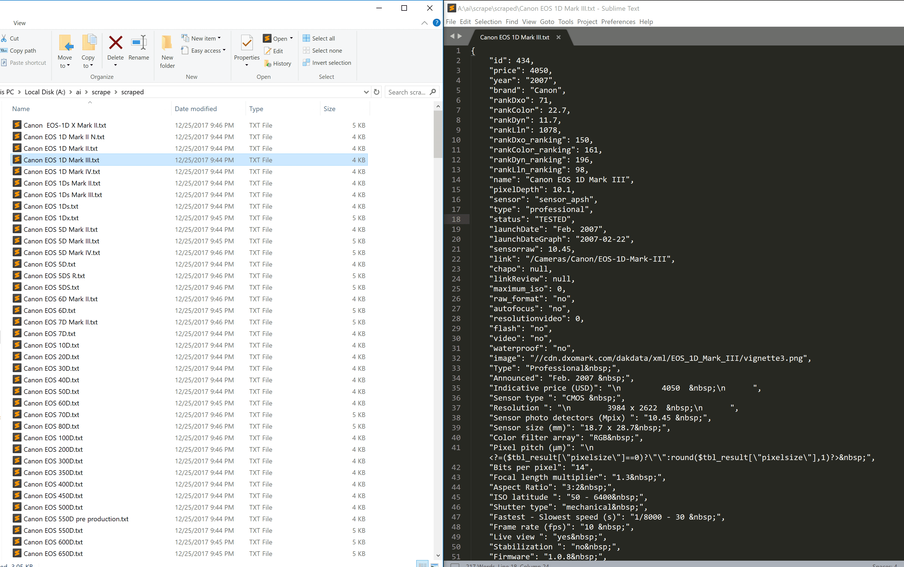
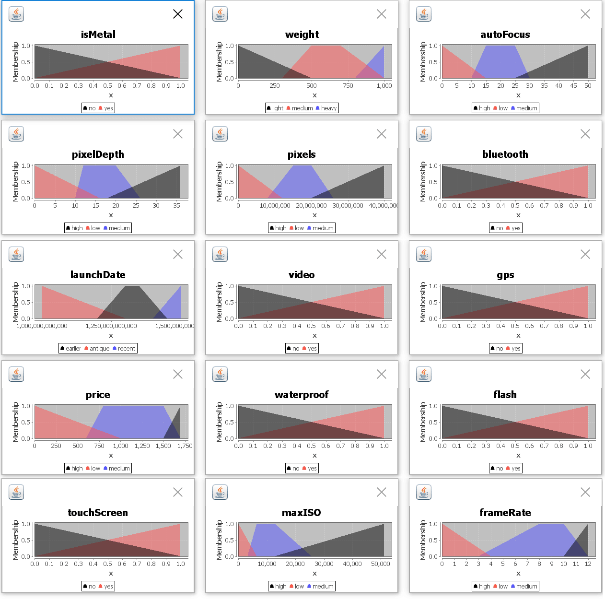
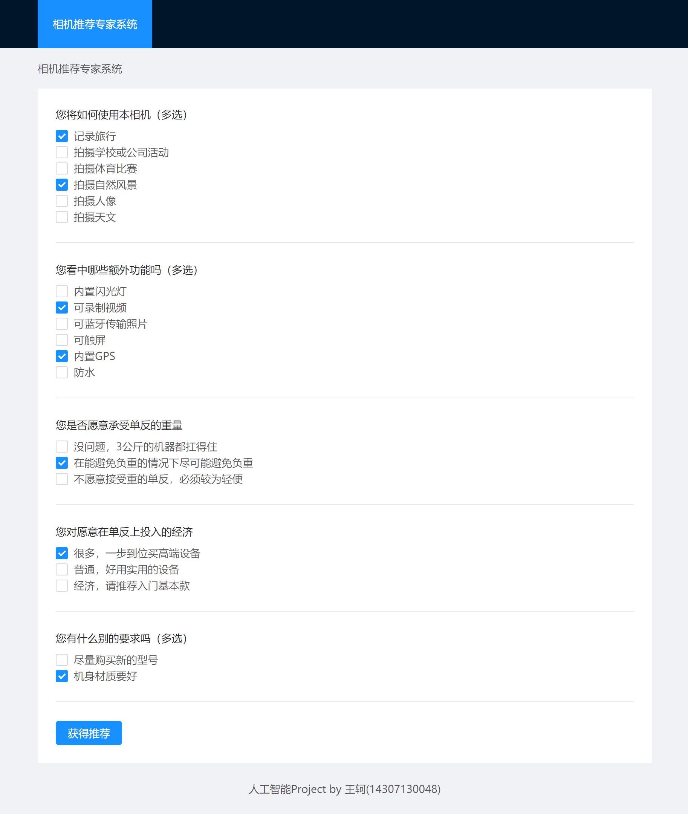
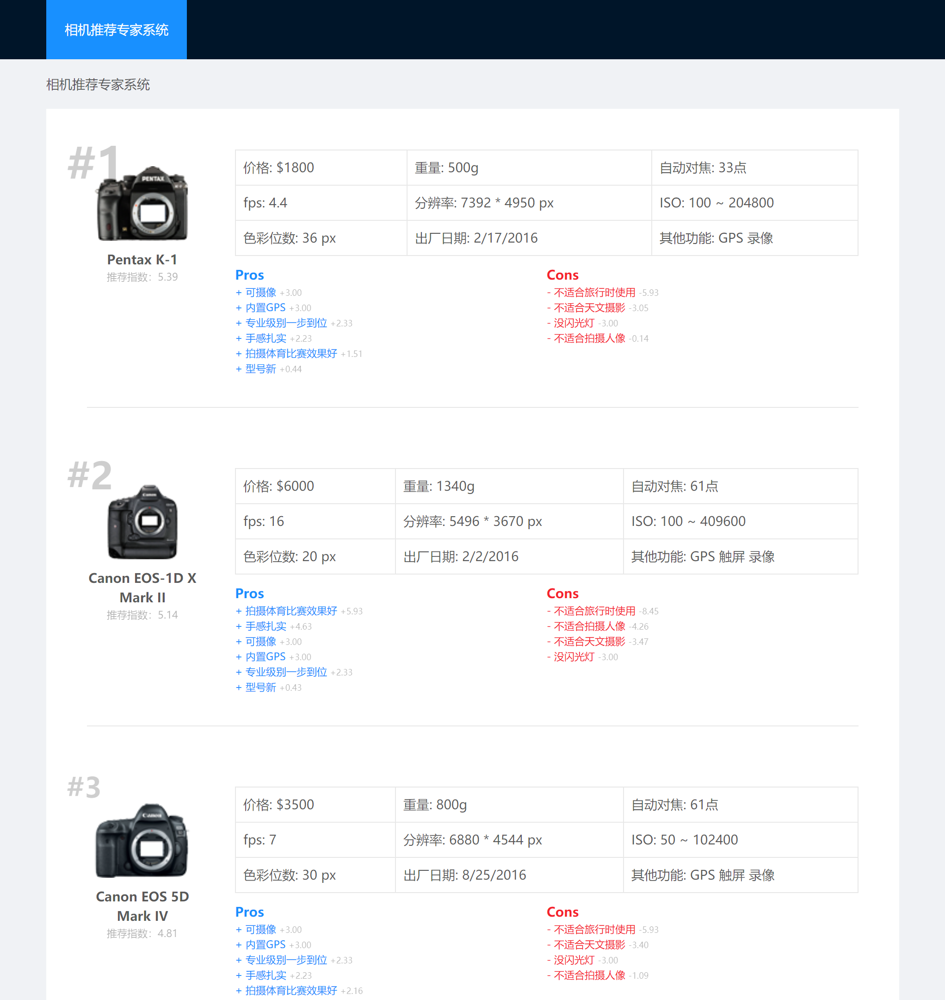

相机导购专家系统
====================================

如今单反相机的高度发达为摄影爱好者带来了无限的可能，让每个人都可以在花不是那么多钱的情况下创造艺术或是记录生活。我认为，这是科技给人带来的福音。

然而，正是因为单反市场太过发达，初入单反坑的玩家往往被搞得晕头转向。常见的单反厂商有尼康、索尼、佳能。高端市场有哈苏、徕卡，低端市场有理光、富士等。每个品牌又有很多个产品线，各有不同，设计给不同需求的用户使用。

如果对单反相机的参数没有深入的研究，仅仅是听商家的吹捧，那很难在最高的性价比上买到合适自己的那款相机。往往会花冤枉钱，或发现相机的主打功能自己根本就用不上。

本专家系统就为了解决这个问题而创建，担任一个细心公正的相机导购师，通过询问用户更在意哪方面的内容、平时使用情景、预算、对重量的承受能力等，为用户推荐最合适的相机，让用户少花冤枉钱，用最少的钱买到最有用的相机。

# 数据库的采集

对专家系统而言，不仅要有规则数据库，相机本身各项指标的数据库也非常重要。本专家系统采集权威平台：DxOMark的数据库，来获得详细的相机各项指标数据。

由于没有现成的数据可供下载，我自己使用NodeJS写了采集程序来做这件事情。代码如下：

```javascript
let request = require('request').defaults({ 'proxy': "http://127.0.0.1:1080" });
let Queue = require('promise-queue');
let fs = require('fs');
let path = require('path');
let queue = new Queue(10); //最多同时10线程采集

request('https://www.dxomark.com/daksensor/ajax/jsontested', //获得相机列表
  (error, response, body) => {
    let cameraList = JSON.parse(body).data;
    let finishedCount = 0;
    cameraList.forEach(cameraMeta => {
      let camera = Object.assign({}, cameraMeta);
      let link = `https://www.dxomark.com${camera.link}---Specifications`; //拼合对应的规格网址
      queue.add(() => new Promise(res => { //把request放入队列，以保证同时http请求不超过10个
        let doRequest = () => {
          request(link, (error, response, body) => {
            if (error) { //如果失败则重试
              console.log("retrying.." + camera.name);
              doRequest();
              return;
            }
            let specMatcherRegexp = /descriptifgauche.+?>([\s\S]+?)<\/td>[\s\S]+?descriptif_data.+?>([\s\S]+?)<\/td>/img;
            let match = specMatcherRegexp.exec(body);
            while (match) {  //用正则表达式匹配table里的每一个项目，并添加至采集结果中
              camera[match[1]] = match[2];
              match = specMatcherRegexp.exec(body);
            }
            fs.writeFileSync(path.join('./scraped', camera.name + '.txt'), JSON.stringify(camera, null, 4), { encoding: "UTF8" });
            finishedCount++;
            console.log(`Finished ${finishedCount}/${cameraList.length}: ${camera.name}`);
            res();
          })
        };
        doRequest();
      }));
    });
  });
```

采集结果如图所示，总共采集到357款单反产品：


# 数据清洗

数据采集完了，但有些数据比较脏（如含有&nbsp），有些数据是我们不需要的，有些数据用起来不方便（如分辨率是 1234 x 1234形式的字符串），属性名中有空格和大写字符，也不美观。因此，额外添加一步数据清洗。

数据清洗之后，希望留下以下属性：

> 相机名称、相机图片、价格、像素数量、每秒连拍数量、重量、对焦系统质量、最大感光度、模型出厂日期、触屏存在、可录视频、有闪光灯、有蓝牙、有GPS、防水、机身材质质量

数据清洗的代码实现为：
```javascript
let fs = require("fs");
let path = require("path");

function parseNumberFunctionFactory(keyMatcher, valueMatcher = /(\d+\.?\d*)/im,
                                    returnValueDecider = match => +match[1]) {
    return (data) => {
        let key = Object.keys(data).filter(_ => keyMatcher.test(_.trim()))[0];
        if (!key) return null;
        let match = data[key].toString().match(valueMatcher);
        if (match)
            return returnValueDecider(match);
        else
            return null;
    };
}

let parseResolution = parseNumberFunctionFactory(/^resolution$/im, /(\d+)\s*x\s*(\d+)/im, match => [+match[1], +match[2]]);
let parseFrameRate = parseNumberFunctionFactory(/frame rate/im);
let parseWeight = parseNumberFunctionFactory(/weight/im);
let parseAutoFocus = parseNumberFunctionFactory(/number of autofocus points/im);
let parseISO = parseNumberFunctionFactory(/ISO latitude/im, /(\d+)\s*-\s*(\d+)/im, match => [+match[1], +match[2]]);
let parseLaunchDate = parseNumberFunctionFactory(/launchDateGraph/im, /(\d+)-(\d+)-(\d+)/im, match => new Date(match[1], match[2] - 1, match[3]));
let parseTouchScreen = parseNumberFunctionFactory(/Touch screen/im, /yes/im, match => !!match);
let parseVideo = parseNumberFunctionFactory(/^Video$/m, /yes/im, match => !!match);
let parseFlash = parseNumberFunctionFactory(/^flash$/im, /yes/im, match => !!match);
let parseWaterproof = parseNumberFunctionFactory(/^waterproof$/im, /yes/im, match => !!match);
let parseBluetooth = parseNumberFunctionFactory(/^Bluetooth$/im, /yes/im, match => !!match);
let parseGps = parseNumberFunctionFactory(/^GPS$/im, /yes/im, match => !!match);
let parseIsMetal = parseNumberFunctionFactory(/^camera material$/im, /metal/im, match => !!match);

let files = fs.readdirSync("./scraped");
files.forEach(file => {
    let data = JSON.parse(fs.readFileSync(path.join('./scraped', file), { encoding: "utf8" }));
    let resolution = parseResolution(data);
    //机身材质质量
    let frameRate = parseFrameRate(data);
    let weight = parseWeight(data);
    let autoFocus = parseAutoFocus(data);
    let iso = parseISO(data);
    let launchDate = parseLaunchDate(data);
    let touchScreen = parseTouchScreen(data);
    let video = parseVideo(data);
    let flash = parseFlash(data);
    let waterproof = parseWaterproof(data);
    let bluetooth = parseBluetooth(data);
    let gps = parseGps(data);
    let isMetal = parseIsMetal(data);
    let cleanedData = {
        name: data.name,
        image: data.image,
        brand: data.brand,
        price: data.price,
        pixelDepth: data.pixelDepth,
        pixels: resolution ? (resolution[0] * resolution[1]) : 0,
        ISO: iso,
        maxISO: iso ? iso[1] : 0,
        launchDate: +launchDate,
        touchScreen,
        video,
        flash,
        waterproof,
        bluetooth,
        gps,
        isMetal,
        frameRate,
        resolution,
        weight,
        autoFocus,
    };
    fs.writeFileSync(path.join('./cleaned', file), JSON.stringify(cleanedData, null, 4), { encoding: "utf8" });
});
```

清洗结果演示：
```json
{
    "name": "Nikon D5",
    "image": "//cdn.dxomark.com/dakdata/xml/D5/vignette3.png",
    "brand": "Nikon",
    "price": 6500,
    "pixelDepth": 20.8,
    "pixels": 20817152,
    "ISO": [
        50,
        3280000
    ],
    "maxISO": 3280000,
    "launchDate": 1452009600000,
    "touchScreen": true,
    "video": true,
    "flash": null,
    "waterproof": null,
    "bluetooth": null,
    "gps": true,
    "isMetal": true,
    "frameRate": 14,
    "resolution": [
        5584,
        3728
    ],
    "weight": 1225,
    "autoFocus": 153
}
```
看起来好多了。

# 问题的设计
斟酌一番后，我决定将询问用户的问题定为：

1. 您将如何使用本相机（多选）
   * 记录旅行
   * 拍摄学校或公司活动
   * 拍摄体育比赛
   * 拍摄自然风景
   * 拍摄人像
   * 拍摄天文
2. 您看中哪些额外功能吗（多选）
   * 内置闪光灯
   * 可录制视频
   * 可蓝牙传输照片
   * 可触屏
   * 内置GPS
   * 防水
3. 您是否愿意承受单反的重量
   * 没问题，3公斤的机器都扛得住
   * 在能避免负重的情况下尽可能避免负重
   * 不愿意接受重的单反，必须较为轻便
4. 您愿意在单反上投入的经济
   * 很多，一步到位买高端设备
   * 普通，好用实用的设备
   * 经济，请推荐入门基本款
5. 您有什么别的要求吗（多选）
   * 尽量购买新的型号
   * 机身材质要好


# 模糊专家系统的设计

一个显著的问题是：模糊专家系统一般只能用于数值的计算（如评估房价），但我这里做的，却是根据用户的输入推荐产品。用模糊专家系统如何做产品推荐呢？

绕一个弯，不难解决这个问题：使用模糊专家系统对每一款相机产品计算出一个“推荐度”，根据推荐度排序，给用户推荐排名前三的产品。

具体的，我使用专家系统，计算出以下几个指标：

> 适合拍摄旅行，适合拍摄活动，适合拍摄体育，适合拍摄风景，适合拍摄人像，适合拍摄天文，型号新，机身材质好，重量轻，价格低

用户的要求可以和这几个指标对号入座，来计算要求满足度。

对于另外一些如“有内置闪光灯”等指标，用不着用模糊专家系统，直接布尔判断来算满足度。

满足度根据规则加权平均，就是产品的总推荐度，排序后，前几名就是推荐给用户的相机。

这样做的好处，除了推荐相机之外，还可以列出相机的Pros & Cons （如：+ 适合拍摄天文 + 可录制视频 - 重量较重），只要去取满足度最高/最低的几名就可以了。

为实现模糊专家系统，我使用jFuzzyLogic框架，它是Java下最完整的模糊逻辑框架，支持fuzzy language (FCL)，IEC 61131-7标准。

# 规则的建立

模糊专家系统在相机推荐中，最重要的工作就是：建立相机参数和相机适合拍摄的照片种类之间的联系，比如：

>  适合拍摄体育类型相片的相机，需要有**很高**的连拍速度、**较好**的对焦系统。

在这个实验性的导购系统中，由我自己担任“领域专家”的角色。

首先，要定义术语，如：

* 价格（美金）便宜: \$0-1000 中等: \$600-1700 贵: \$1500-

翻译成FCL之后：

```
FUZZIFY price
	TERM low := (0, 1) (1000, 0) ;
	TERM medium := (600, 0) (800,1) (1500,1) (1700,0);
	TERM high := (1500, 0) (1700, 1);
END_FUZZIFY

FUZZIFY weight
	TERM light := (0, 1) (500, 0) ;
	TERM medium := (300, 0) (500,1) (700,1) (1000,0);
	TERM heavy := (800, 0) (1000, 1);
END_FUZZIFY

...
```

每个术语的定义如图所示：



然后，要定义defuzzify规则，这里方便起见，均只定义“veryGood”、“good”、"average"、"bad"、"veryBad"。

```
DEFUZZIFY travel
	TERM veryBad := (0,1) (0.2,0);
	TERM bad := (0,0) (0.1,1) (0.5,0);
	TERM average:= (0,0) (0.5,1) (1,0);
	TERM good:= (0.5,0) (0.9,1) (1,0);
	TERM veryGood:= (0.8,0) (1,1);
	METHOD : COG;
	DEFAULT := 0.5;
END_DEFUZZIFY
```

最后，要定义规则，举例如下：

* 如果 感光度范围 很高 而且 像素 高 那么 适合拍天文 高

* 如果 连拍速度 很高 而且 对焦系统 好 那么 适合拍体育 高

* 如果 重量 轻 且 有GPS 那么 适合记录旅行 高

* ……

翻译成FCL之后：

```
RULEBLOCK travel
	AND : MIN;
	RULE 1 : IF weight IS light THEN travel IS good;
	RULE 2 : IF video IS yes THEN travel IS good;
	RULE 3 : IF gps IS yes THEN travel IS good;
	RULE 4 : IF flash IS no THEN travel IS bad;
	RULE 5 : IF weight IS heavy THEN travel IS veryBad;
END_RULEBLOCK

RULEBLOCK sports
	AND : MIN;
	RULE 1 : IF frameRate IS high THEN sports IS veryGood;
	RULE 2 : IF autoFocus IS high THEN sports IS veryGood;
	RULE 3 : IF pixels IS high THEN sports IS good;
	RULE 4 : IF frameRate IS low THEN sports IS veryBad;
	RULE 5 : IF autoFocus IS low THEN sports IS veryBad;
END_RULEBLOCK

RULEBLOCK astronomy
	AND : MIN;    
	RULE 1 : IF pixels IS high THEN astronomy IS good;
	RULE 2 : IF pixelDepth IS high THEN astronomy IS good;
	RULE 3 : IF maxISO IS high THEN astronomy IS good;
	RULE 4 : IF maxISO IS low THEN astronomy IS veryBad;
	RULE 5 : IF pixels IS low THEN astronomy IS veryBad;
END_RULEBLOCK

...
```

# 打分的具体实现
数据和规则都准备就绪后，就可以开始进行模糊推理。

Java程序框架如下：

```java
package ai.fuzzy;

import com.alibaba.fastjson.JSON;
import net.sourceforge.jFuzzyLogic.FIS;
import net.sourceforge.jFuzzyLogic.FunctionBlock;
import net.sourceforge.jFuzzyLogic.plot.JFuzzyChart;
import net.sourceforge.jFuzzyLogic.rule.Variable;

import java.io.*;
import java.nio.file.Paths;

class CameraData {
    public CameraAssessment assessment;
    public String name;
    public String image;
    public String brand;
    public Integer price;
    public Integer pixelDepth;
    public Integer pixels;
    public Integer maxISO;
    public Integer weight;
    public Integer autoFocus;
    public Long launchDate;
    public Float frameRate;
    public Integer[] resolution;
    public Integer[] ISO;
    public boolean touchScreen;
    public boolean video;
    public boolean flash;
    public boolean waterproof;
    public boolean bluetooth;
    public boolean gps;
    public boolean isMetal;
}

class CameraAssessment {
    public double travel;
    public double event;
    public double sports;
    public double scenery;
    public double portrait;
    public double astronomy;
    public double newModel;
    public double durableBuild;
    public double lightBuild;
    public double lowPrice;
}

public class Main {
    public static void main(String[] args) throws IOException {
        File rootFolder = new File("input");
        for (final File fileEntry : rootFolder.listFiles()) {
            if (fileEntry.isFile()) {
                CameraData camera = JSON.parseObject(readFileContents(fileEntry), CameraData.class);
                camera.assessment = assess(camera);
                writeFile(fileEntry, JSON.toJSONString(camera, true));
            }
        }
    }

    private static void writeFile(File fileEntry, String jsonString) throws FileNotFoundException {
        ...
    }

    private static String readFileContents(File fileEntry) throws IOException {
        ...
    }

    static CameraAssessment assess(CameraData cameraData) {
        ...
    }
}

```

```assess```函数如下：

```java

    static CameraAssessment assess(CameraData cameraData) {
        CameraAssessment cameraAssessment = new CameraAssessment();
        String fileName = "fcl/camera.fcl";
        FIS fis = FIS.load(fileName, true);

        // Set inputs
        fis.setVariable("price", cameraData.price);
        fis.setVariable("pixelDepth", cameraData.pixelDepth);
        fis.setVariable("pixels", cameraData.pixels);
        fis.setVariable("maxISO", cameraData.maxISO);
        fis.setVariable("weight", cameraData.weight);
        fis.setVariable("autoFocus", cameraData.autoFocus);
        fis.setVariable("launchDate", cameraData.launchDate);
        fis.setVariable("frameRate", cameraData.frameRate);
        fis.setVariable("touchScreen", cameraData.touchScreen ? 1 : 0);
        fis.setVariable("video", cameraData.video ? 1 : 0);
        fis.setVariable("flash", cameraData.flash ? 1 : 0);
        fis.setVariable("waterproof", cameraData.waterproof ? 1 : 0);
        fis.setVariable("bluetooth", cameraData.bluetooth ? 1 : 0);
        fis.setVariable("gps", cameraData.gps ? 1 : 0);
        fis.setVariable("isMetal", cameraData.isMetal ? 1 : 0);

        // Evaluate
        fis.evaluate();

        // Save results to cameraAssessment
        cameraAssessment.travel = fis.getVariable("travel").defuzzify();
        cameraAssessment.event = fis.getVariable("event").defuzzify();
        cameraAssessment.sports = fis.getVariable("sports").defuzzify();
        cameraAssessment.scenery = fis.getVariable("scenery").defuzzify();
        cameraAssessment.portrait = fis.getVariable("portrait").defuzzify();
        cameraAssessment.astronomy = fis.getVariable("astronomy").defuzzify();
        cameraAssessment.newModel = fis.getVariable("newModel").defuzzify();
        cameraAssessment.durableBuild = fis.getVariable("durableBuild").defuzzify();
        cameraAssessment.lightBuild = fis.getVariable("lightBuild").defuzzify();
        cameraAssessment.lowPrice = fis.getVariable("lowPrice").defuzzify();

        return cameraAssessment;
    }
```

调用后，模糊专家系统就会给每个相机做评测，并作出如下输出：

```json
"assessment": {
      "astronomy": 0.07206054514320881,
      "durableBuild": 0.1999999999999999,
      "event": 0.1999999999999999,
      "lightBuild": 0.1999999999999999,
      "lowPrice": 0.1999999999999999,
      "newModel": 0.20107756449438624,
      "portrait": 0.2280106572609703,
      "scenery": 0.2280106572609703,
      "sports": 0.07875190169689873,
      "travel": 0.16167332382310975,
    },
```

分别是相机对于每一项情景的适合度，在0-1之间。

接下来，需要把用户输入和适合度整合，得出总评分。

这里，总评分直接通过用户输入和适合度做内积的方法获得，评分的同时，也记录分数变动记录，这样给用户推荐就可以说明推荐原因。

```javascript
function evaluate(item, tags) {
  let score = 0, changes = [];
  tags.forEach(tag => {
    let reverse = false;
    let normalizedTag = tag;
    if (tag.startsWith("!")) {
      //允许使用!开头，表示相反。如：!lowPrice时，lowPrice原本加分现在变成减分
      reverse = true;
      normalizedTag = tag.substr(1);
    }
    let scoreChange = 0;
    if (item.assessment[normalizedTag]) { // 如果是专家系统assess出来的结果，一个占20分
      scoreChange = (reverse ? -1 : 1) * (item.assessment[normalizedTag] * 20) * (weight[normalizedTag] || 1);
    } else { // 如果不是，那么是“防水”等基本要求，一个占3分
      scoreChange = (reverse ? -1 : 1) * (item[normalizedTag] ? 1 : -1) * 3 * (weight[normalizedTag] || 1);
    }
    if (scoreChange) {
      score += scoreChange;
      changes.push([scoreChange, tag]); // 记录评分变化，之后好出pros & cons
    }
  });
  return { score, changes };
} 
```

系统核心算法大致就完成了。

# 参数调整
参数调整方面，花了不少心思。

原来的专家系统规则中，用了比较多的OR，导致多款相机某个指标打分非常相近，没有区分度。因此，我后来重写了FCL，尽量避免使用OR。为了拉开差距，我还把原来的“good”、"average"、"bad"改成了“veryGood”、“good”、"average"、"bad"、"veryBad"，以说明某些规格的重要性大于其他规格。

由于RULES的good、bad不平衡，会导致一些assessment普遍偏低，另一些普遍偏高，因此，在后续处理中，我把这些assessment进行了normalization，让他们的平均值归一到0。

又出现了新的问题：推荐的相机，基本都是“价格低”、“型号新”，即这两个特性给相机总体加分太多，掩盖了别的优点，因此，我人工指定了指标的权重，以削弱价格和型号新旧对总体评分的影响，彰显“适合拍的类型”在推荐中的占比。

但还有很多问题，其中最主要的是：数据区分度不明显，高端相机的数据都差不多；指标内部有较强的关联性（合适拍天文的，一般也合适拍风景）。数据内部关联性不好解决。

经过一番调整，系统可以产生尚可的结果。

# 前端与运行效果

为了获得更好的效果，我为专家系统做了一个用户友好的前端界面，可以引导用户输入信息、以用户友好的方式给出推荐结果。前端是使用React + antd做的，基于Web。代码省略，界面长这样：



以上用户选择会被转换为tags:

```json
["travel", "scenery", "video", "gps", "!lowPrice", "durableBuild"]
```

然后，这些tags会被送到之前设计好的系统中进行运算（内积rank），获得结果。



可以看出，本系统可以根据用户的需要推荐相机（Pros和Cons都与用户第一步选择的“需求”有关）。

并能以一种易于理解的方式说清楚每一项“需求”是如何影响最终打分的。

# 结论

本导购系统只是一个试水，效果还过得去。

在进行导购系统制作的过程中，我充分体验了制作一个专家系统需要的每一个步骤。从采集数据，到模糊集定义，到模糊集推理，到整合结果并输出给用户看。

这个专家系统与普通的估测房价/工资/小费的模糊专家系统不同，必须对模糊专家系统defuzzify之后的结果进行进一步的整合，并给用户做出推荐。这个整合算法，应该也能算是广义专家系统的一部分吧。

效果比预期的稍微差一些，我认为原因主要在：

1. 原始数据不够完整（DxOMark上仍然很多型号缺很多数据）
2. 数据区分度不高、内部关联性太强（高端相机的指标都差不多；合适拍天文的，一般也合适拍风景）

进一步完善数据库、调整参数、或换一种性价比的模型之后，有望提升整体效果。

但无论如何，本专家系统至少做到了往正确的方向响应用户的输入，有理有据地为用户推荐符合要求的相机。

这种专家系统是有价值的，在进一步的优化后，说不定能产生一些商业效益。

现在我仅仅对机身做了推荐，如果加上镜头的组合，那么规则更加复杂、要考虑的因素更加多。

但按照规则解决这些复杂的问题，或许就是专家系统真正意义所在。真的解决之后，专家系统就可以和一个专业的人类导购师一样，耐心服务每一位顾客，让每个人都把钱花在刀刃上。